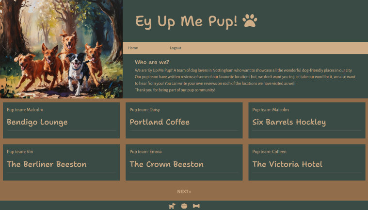

# Ey Up Me Pup!

Deployed project can be found [here](https://ey-up-me-pup-44c5def591d6.herokuapp.com/).

#### A note on the name
"Ey Up Me Duck" is a commonly used phrase in the East Midlands (including Nottingham). It is a term of endearment which essentially means "hello my dear". 'Ey Up Me Pup!' is a play on words on this popular phrase. 

## User experience
### Purpose
- Ey Up Me Pup! is designed for dog owners in Nottingham. The 'Pup Team' write reviews on various pubs, cafes and other locations based on how dog friendly they are - users can then write their own reviews on these locations. 
- It is designed to foster a sense of community within the dog owners of Nottingham and to allow users to share their experiences with others.
- The target audience of 'Ey Up Me Pup!' would be Nottingham locals and tourists with dogs. Or anyone who loves dogs! 

## Agile methodology
- Agile methodology is "a set of methods and practices where solutions evolve through collaboration between self-organizing, cross-functional teams" ([reference](https://www.agilealliance.org/agile-essentials/)).
- A project board was set-up to keep track of user stories. Each user story was assigned a 'MoSCoW' prioritisation (must have, should have, could have, won't have) tag. The board can be found [here](https://github.com/users/elamont174/projects/5/views/1).

### User stories

1. As a user I can register an account and log-in to the site so that I can leave reviews.
* SUCCESS CRITERIA
- I can use my email address to create an account
- Once registered, I can log-in to my account using my email address and a passsword
- When I am logged in, I can leave comments

2. As a user I can click on reviews so that I can read the content.
* SUCCESS CRITERIA
- When the review is clicked on, the full content appears

3. As a user I can navigate easily to different pages so that I have a more refined user experience.
*SUCCESS CRITERIA
- A navigation page will exist where users can choose from pup-friendly CAFES, PUBS or OTHER.
- By clicking on the relevant link, the user will be taken to the relevant page e.g. clicking CAFES will take the user to the CAFES reviews page
- The navigation page itself will be easy to navigate to

4. As a registered user I can leave a review so that I can interact with others.
*SUCCESS CRITERIA
- As a registered user, I can leave a review on the relevant page (i.e. pub review in pub page)
- As part of the review, I can leave a rating (1-5 'paws')
- As part of the review, I can write text
- The title of the review should be the name of the location

5. As an admin I can moderate posts so that posts are not published without admin approval.
* SUCCESS CRITERIA
- When user clicks 'post', they will receive a message advising them that their post has been sent to admins for approval
- Admins would be able to publish or delete posts once they have been checked

6. As a registered user I can edit my own review so that I can edit or change a review that I created.
* SUCCESS CRITERIA
- If I created a review, I can edit it

7. As a registered user I can delete my own review so that I can delete a review that I created.
* SUCCESS CRITERIA
- If I created a review, I can delete it

## Design
### Wireframes
- [Click here for design wireframe](static/images/pup-wireframe.png)

### Colour Scheme
-An image of dogs was used as the central image due to the main theme of the website being about dogs. Leonardo AI was used to generate a beautiful 'painting' - this was then run through a colour picker to generate a colour palette. This colour palette was used throughtout the website to complement this central image. 

- 

#### Colour palette
- 
- tan: #cead87
- cocoa-brown: #292220
- leather: #926d4c
- irish-coffee: #613a29
- willow-grove: #646e5c
- donkey-brown: #a69e72
- copper: #bd8130
- cape-cod: #3a4b46
- regent-gray: #8392a5
- san-juan: #38526d

- Tan (#cead87) and cape-cod (#3a4b46) were used as high contrast colours in the header and footer. High contrast is important for easy reading for the user, providing a positive user experience. It is also for this reason that cocoa-brown (#292220) and leather (#926d4c) were used together as the main background colour.

### Typography
- Google fonts were used to source the font styles.
- Sans-serif is considered the best type of font to read for those who have dyslexia or autism so only sans-serif type fonts were chosen.
- Since the website is for dog owners, and contributed to by dog owners, a handwritten style of font was used for the title to signify that this is a more casual, user-friendly website. The "Shantell Sans" was chosen for it's playful feel.
- 
- For the content of the website, "Alegreya Sans" was chosen as a cleaner font which is easier to read, while still being slightly softer on the eye.
- 

## Images
- All review images were linked from Google Images using their Image URL.

## Features

## Database
- I used Code Institute's PostgreSQL database.
### Creating a database
1. Navigate to [PostgreSQL](https://dbs.ci-dbs.net/) from Code Institute.
2. Enter your student email address in the input field provided.
3. Click Submit.
4. Wait while the database is created.
5. Check your email.
6. You now have a URL you can use to connect your app to your database.

## Deployment
- The website was deployed to Heroku and can be found [here](https://ey-up-me-pup-44c5def591d6.herokuapp.com/).
### Heroku
- You will need a Heroku log-in to be able to deploy a website to Heroku.
- Once you have logged into Heroku:
1. Click 'New' > 'Create new app'
2. Choose a unique name, choose your region and press 'Create app'
3. Click on 'Settings' and then 'Reveal Config Vars'
4. Add a key of 'DISABLE_COLLECTSTATIC' with a value of '1'.
5. Add a key of 'DATABASE_URL' - the value will be the URL you were emailed when creating your database.
6. Add a key of 'SECRET_KEY' - the value will be any random secret key (google 'secret key generator' and use it to generate a random string of numbers, letters and characters)
7. In your code you will need to install project requirements:
- pip3 install gunicorn~=20.1 
- pip3 freeze --local > requirements.txt
8. Create a file at the root directory called Procfile. In this file enter: "web: gunicorn my_project.wsgi" (without the quotes)
9. In settings.py, set DEBUG to False. 
- YOU SHOULD ALWAYS SET DEBUG TO FALSE BEFORE DEPLOYING FOR SECURITY
10. Add ",'.herokuapp.com' " (without the double quotes) to the ALLOWED_HOSTS list in settings.py
11. Add, commit and push your code.
12. Go back to Heroku, click on the 'Deploy' tab.
13. Connect your project to GitHub.
14. Scroll to the bottom and click 'Deploy Branch' and your project will be deployed!

### Cloning
- To clone a GitHub repository:
1. On GitHub.com, navigate to the repository you want to clone.
2. Click the "Code" button (found above the list of files).
3. Copy the URL for the repository.
4. Open Git Bash or your chosen terminal.
5. Navigate to the directory where you want to clone the repository.
6. Type: git clone https://github.com/elamont174/ey-up-me-pup.git
7. Press Enter to create your local clone.

### Forking
- 'Forking' the GitHub repository means creating a copy which can be viewed/changed without changing the original.
- To fork a GitHub repository:
1. Login to GitHub and navigate to the repository you want to fork.
2. Click the "Fork" button (found above the Settings button).
3. You will now have a copy of the original repository in your GitHub account.

## Technologies used
- HTML was used to structure the content of the website.
- CSS were used to design the layout of the website.
- Bootstrap was used as a CSS framework to provide a grid structure and improve responsiveness.
- Python and Django were used to build the backend review framework.
- GitHub was used to host the repository and version control.
- Heroku was the hosting platform.

### Database planning
- 

## Testing
- Please see [TESTING.md](TESTING.md) file for all testing.

## Credits
- I used the "I Think Therefore I Blog" walkthrough from the course content as a basis for my project to help me understand the Django. I customised the models, views and templates to create my own unique website. 
- [Destiny Franks(Desphixs)](https://www.youtube.com/watch?v=gBJMM3ZQLpk) YouTube tutorial helped me to learn the code to implement my 'paws' rating system.
- [Leonardo AI] (https://leonardo.ai/) was used to generate the central image of dogs seen on the header of the website. 
- [Imagecolourpicker.com](https://imagecolorpicker.com/) was used to generate the colour palette from the image of the dogs produced by Leonardo AI.
- [HTMLcolourcodes](https://htmlcolorcodes.com/color-picker/) was used to help understand complementary and analogous colourd to help pick colours. 
- All review images were linked from Google Images using their Image URL.
- [Google Fonts](https://fonts.google.com/) were used to source the font styles.
- Balsamiq was used to create the design wireframe.
- Microsoft PowerPoint was used to create the EPR image.
- [TabletoMarkdown.com](https://tabletomarkdown.com/convert-spreadsheet-to-markdown/) was used to create the tables in TESTING.md from a Microsoft Excel spreadsheet that I created.
- Google Extension 'Responsive Viewer' was used to create the screenshots for the Responsiveness section of TESTING.md.

## Acknowledgements
- My mentor Julia has, as always, been an incredible support. 
- I have to thank the Code Institute Student Care team for looking after me so well during a period of intense illness.
- I have made some wonderful friends through hackathons who allowed me to read through their READMEs and look at their projects when I was planning out my project at the beginning. Thank you Stephen Dawson, Rachel O'Donnell and Kyle Clow. 
- My long-suffering husband, Malcolm Lamont, for... everything.
- My dad, Calum Weir, for feeding me and letting me borrow his computer monitor as a second screen. 