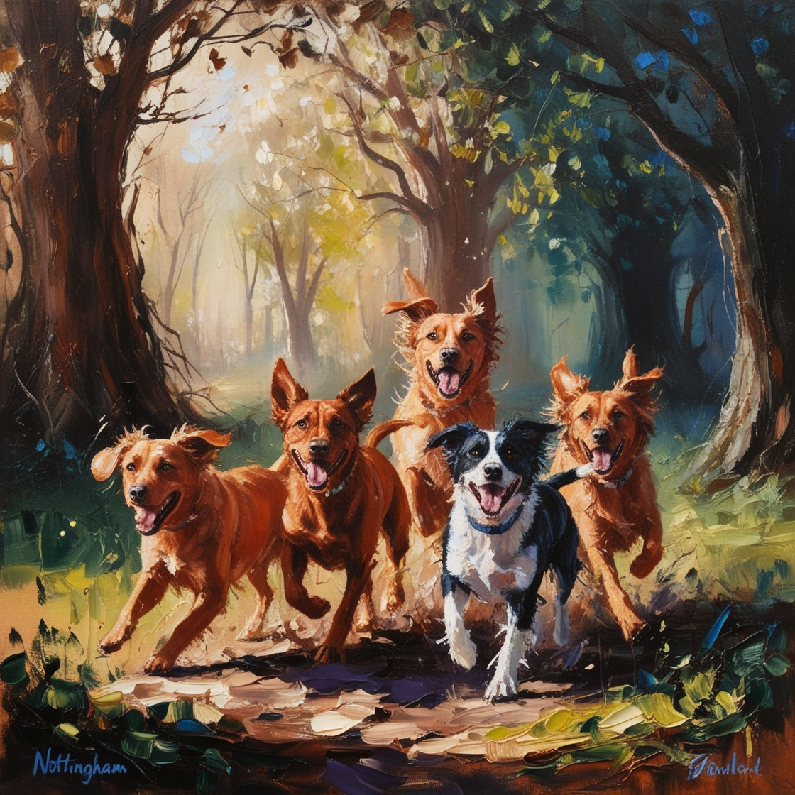
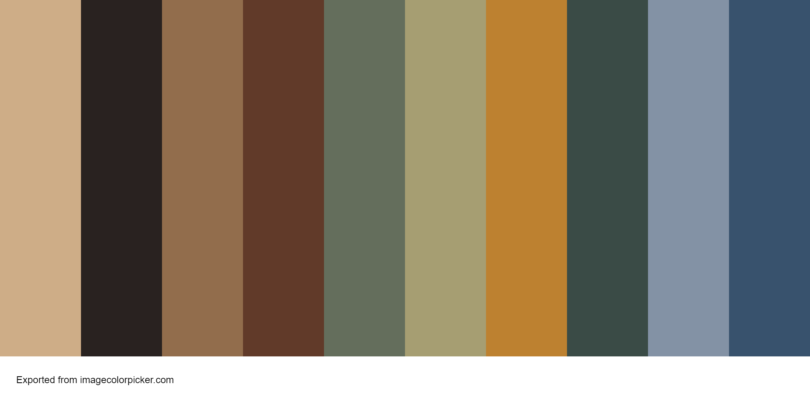
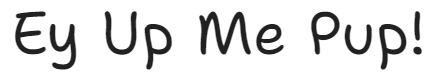
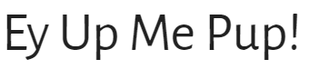
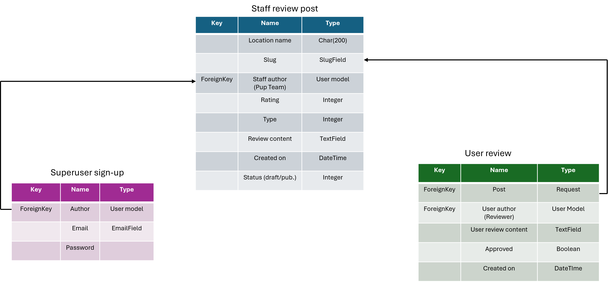

# Ey Up Me Pup!

## Project Aims

#### A note on the name
"Ey Up Me Duck" is a commonly used phrase in the East Midlands (including Nottingham). It is a term of endearment which essentially means "hello my dear". 'Ey Up Me Pup!' is a play on words on this popular phrase. 

## User experience
### Purpose
- Ey Up Me Pup! is designed for dog owners in Nottingham. The 'Pup Team' write reviews on various pubs, cafes and other locations based on how dog friendly they are - users can then write their own reviews on these locations. 

### Target audience
- The target audience of Ey Up Me Pup would be locals and tourists with dogs. 

### User stories

## Agile methodology

## Design
### Wireframes
- [Click here for design wireframe](static/images/pup-wireframe.png)

### Colour Scheme
-An image of dogs was used as the central image due to the main theme of the website being about dogs. Leonardo AI was used to generate a beautiful 'painting' - this was then run through a colour picker to generate a colour palette. This colour palette was used throughtout the website to complement this central image. 

- 

#### Colour palette
- 
- tan: #cead87
- cocoa-brown: #292220
- leather: #926d4c
- irish-coffee: #613a29
- willow-grove: #646e5c
- donkey-brown: #a69e72
- copper: #bd8130
- cape-cod: #3a4b46
- regent-gray: #8392a5
- san-juan: #38526d

- Tan (#cead87) and cape-cod (#3a4b46) were used as high contrast colours in the header and footer. High contrast is important for easy reading for the user, providing a positive user experience. It is also for this reason that cocoa-brown (#292220) and leather (#926d4c) were used together as the main background colour.

### Typography
- Google fonts were used to source the font styles.
- Sans-serif is considered the best type of font to read for those who have dyslexia or autism so only sans-serif type fonts were chosen.
- Since the website is for dog owners, and contributed to by dog owners, a handwritten style of font was used for the title to signify that this is a more casual, user-friendly website. The "Shantell Sans" was chosen for it's playful feel.
- 
- For the content of the website, "Alegreya Sans" was chosen as a cleaner font which is easier to read, while still being slightly softer on the eye.
- 

## Images
- All review images were linked from Google Images using their Image URL.

## Features

## Database

## Technologies used
- HTML was used to structure the content of the website.
- CSS were used to design the layout of the website.
- Bootstrap was used as a CSS framework to provide a grid structure and improve responsiveness.
- Python and Django were used to build the backend review framework.
- GitHub was used to host the repository and version control.
- Heroku was the hosting platform.

### Databases
- 

### Other tools

## Testing

## Deployment
### Heroku
### Cloning
### Forking

## Credits
- I used the "I Think Therefore I Blog" walkthrough from the course content as a basis for my project to help me understand the Django. I customised the models, views and templates to create my own unique website. 
- [Destiny Franks(Desphixs)](https://www.youtube.com/watch?v=gBJMM3ZQLpk) YouTube tutorial helped me to learn the code to implement my 'paws' rating system.
- [Leonardo AI] (https://leonardo.ai/) was used to generate the central image of dogs seen on the header of the website. 
- [Imagecolourpicker.com](https://imagecolorpicker.com/) was used to generate the colour palette from the image of the dogs produced by Leonardo AI.
- [HTMLcolourcodes](https://htmlcolorcodes.com/color-picker/) was used to help understand complementary and analogous colorus to help pick colours. 
- All review images were linked from Google Images using their Image URL.
- [Google Fonts](https://fonts.google.com/) were used to source the font styles.

## Acknowledgements
- My mentor Julia has, as always, been an incredible support. 
- I have to thank the Code Institute Student Care team for looking after me so well during a period of intense illness.
- My long-suffering husband, Malcolm Lamont, for not mentioning the small mountain of coke zero cans next to my laptop.
- My dad, Calum Weir, for feeding me and letting me borrow his computer monitor as a second screen. 