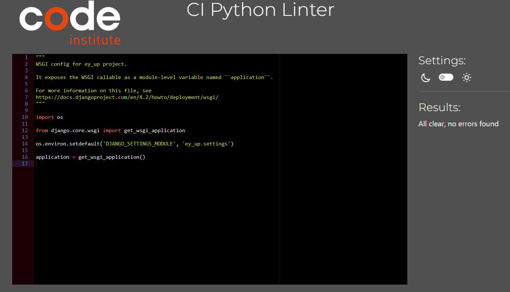

# Testing

- Manual testing was carried out throughout the development of the website and bugs fixed as they arose. 

## Manual testing
- Manual testing was carried out on the local and deployed sites.

| Location           | Feature                 | Expected Outcome                                                                                                                                                                                                                                          | Pass/Fail | Notes                                                                                                                                      |
| ------------------ | ----------------------- | --------------------------------------------------------------------------------------------------------------------------------------------------------------------------------------------------------------------------------------------------------- | --------- | ------------------------------------------------------------------------------------------------------------------------------------------ |
| Header             | Home button             | Takes user to home page on click                                                                                                                                                                                                                          | PASS      |                                                                                                                                            |
| Header             | Log-in button           | Takes user to log-in page on click                                                                                                                                                                                                                        | PASS      | If user is not logged in, the register and log-in buttons will be displayed but if they are logged in, only the log-out button will appear |
| Header             | Register button         | Takes user to registration page on click                                                                                                                                                                                                                  | PASS      |
| Header             | Logout button           | Takes user to log-out page on click                                                                                                                                                                                                                       | PASS      |
| Log-in page        | Log-in function         | When user enters an unknown username, the user will not be logged in                                                                                                                                                                                      | PASS      |                                                                                                                                            |
| Log-in page        | Log-in function         | When user enters an unknown password, the user will not be logged in                                                                                                                                                                                      | PASS      |                                                                                                                                            |
| Log-in page        | Log-in function         | When user enters a known username AND password, the user will be logged in                                                                                                                                                                                | PASS      |                                                                                                                                            |
| Register page      | Register function       | If user does not enter information into any of the fields, they will be prompted to fill in the field                                                                                                                                                     | PASS      |                                                                                                                                            |
| Register page      | Register function       | If user does not enter a password which fits the criteria, will not be registered                                                                                                                                                                         | PASS      |                                                                                                                                            |
| Register page      | Register function       | If user does not enter a matching password into the password (again) box, they will not be registered                                                                                                                                                     | PASS      |                                                                                                                                            |
| Register page      | Register function       | If user enters appropriate details, they will be registered                                                                                                                                                                                               | PASS      |                                                                                                                                            |
| Logout page        | Sign out button         | Signs user out on click                                                                                                                                                                                                                                   | PASS      |                                                                                                                                            |
| Home page          | Staff review card       | Click on staff review to be taken to that review                                                                                                                                                                                                          | PASS      |                                                                                                                                            |
| Home page          | Next button             | If there are more than six staff reviews, a 'next' button will appear. On click, this will load the next six available staff reviews.                                                                                                                     | PASS      |                                                                                                                                            |
| Home page          | Prev button             | If there are more than six staff reviews, a 'next >>' button will appear. On click, this will load the next six available staff reviews. On this page, a '<<prev [previous]' button will appear. On click, this will load the previous six staff reviews' | PASS      |                                                                                                                                            |
| Footer             | Dog icon                | Clicking will take you to the 'Jerry Green Dog Rescue' page (it is a slow loading web-page)                                                                                                                                                               | PASS      |                                                                                                                                            |
| Footer             | Dog food icon           | Clicking will take you to the 'RSPCA' page                                                                                                                                                                                                                | PASS      |                                                                                                                                            |
| Footer             | Dog icon                | Clicking will take you to the 'East Midlands Dog Rescue' page                                                                                                                                                                                             | PASS      |                                                                                                                                            |
| Staff review       | Leave a review function | Leaving the 'Your review' box empty and clicking Submit will prompt the user to fill out the 'Your review' box                                                                                                                                            | PASS      |                                                                                                                                            |
| Staff review       | Leave a review function | Filling out the 'Your review' box and pressing Submit will submit the review for approval                                                                                                                                                                 | PASS      |                                                                                                                                            |
| Staff review       | Delete a review         | Pressing 'Delete' will delete the user review                                                                                                                                                                                                             | PASS      |                                                                                                                                            |
| Staff review       | Edit a review           | Pressing 'Edit' will open the 'Edit your review' page in a new tab                                                                                                                                                                                        | PASS      |                                                                                                                                            |
| Edit a review page | Edit a review           | Entering a review/rating and pressing submit will update review needing edited                                                                                                                                                                            | PASS      |                                                                                                                                            |

## Bugs
- Initially there were going to be multiple reviews for one location and I based the slug off of the location name. I later realised that thiswould mean that there could be identical slugs which would cause major problems. I changed the concept so that there was one central staff review that the slug could be based on and then multiple reviews could be added to this central post. At first I thought to fix this by having a 'review tagline' which the slug would be based on but further developed this idea. 
- When adding the 'edit' feature I initially tried using JavaScript to populate the text-box with the initial comment and then update it. I then changed this to use Views instead. 
- When adding Summernote to the review function, initially it was not showing up at all. After changing the Debug setting it then worked.

## Code validators
### HTML
- The [W3C Validator](https://validator.w3.org/) was used to validate the HTML.
#### Home
- 

#### Logout page
- 

#### Login page
- 

#### Register page
- 
- When I checked the code that the validator was referring to, it was code which was integrated by Django for the review functionality and not written by me. I looked for it everywhere in an attempt to fix it but could not find it. 
- 

#### Example of Staff review (e.g. Bendigo Lounge)
- 
- The code which the validator is referring to is inputted from the admin section of the Django backend framework via summernote. It is not possible to add an 'alt' reference as a user. The </ p> is also code created by the framework.

#### Edit review page
- 

### CSS
- The [W3C CSS Validator](https://jigsaw.w3.org/css-validator/) was used to validate the CSS.
- 

    

### Python
- The [CI Python Linter](https://pep8ci.herokuapp.com/) was used to validate the Python files.
- admin.py
- 
- apps.py
- 
- forms.py
- 
- models.py
- 
- settings.py
- 
- urls.py
- 
- 
- views.py
- 
- Even though one line was considered too long by PEP8 (highlighted), I decided that the readability of the code was better when left on the same line, since it was very close to the accepted limit.
- wsgi.py
- 

### Lighthouse
#### Home
- 

#### Register
- 

#### Login
- 

#### Logout
- 

#### Edit reviews
- 

#### Future improvements based on Lighthouse
- The biggest performance issue was the detailed logo. This was already converted to WEBP so perhaps a less detailed image would be used if this site was to be carried forward.
- Accessibility would be a priority moving forward. The colour palette was chosen based upon the central image and maintained throughout the site for design purposes. Moving forward, more high contrast colours would be chosen.

## Responsiveness
#### Mobile (iPhone 14 Pro)
- 
- 
- 

#### Tablet (iPad Air 5)
- 
- 
- 

#### Desktop (Macbook Air)
- 
- 
- 

## Browsers
- I use Google Chrome as my browser so all screenshots above are from Google Chrome.
- The site was tested on Microsoft Edge:
- 
- The site was tested on Opera:
- 
